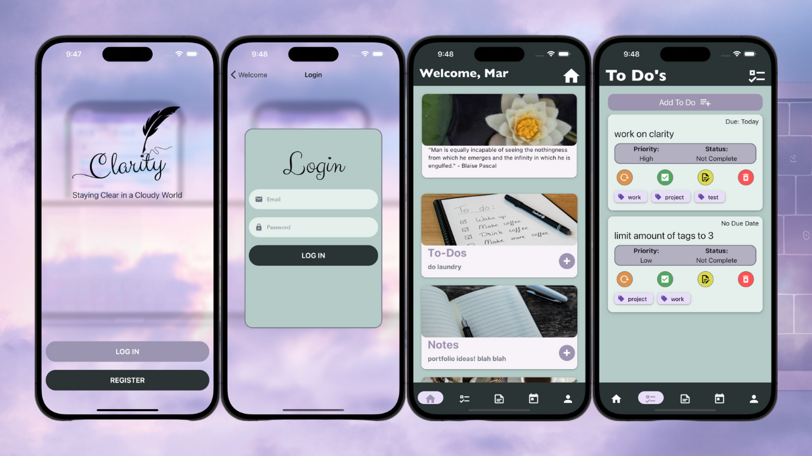

# Clarity Mobile App

Clarity Mobile App is a simple, intuitive mobile application for managing notes, planning your day, and keeping your life organized. We aim to provide a clutter-free, user-friendly platform where users can track their daily tasks, store important notes and more.

## Features

- Simple and intuitive UI
- Easy note creation and management
- Seamless syncing across all your devices
- And more...

## Getting Started

## Screenshots

## Feedback

If you have any feedback or issues, please file an issue on this repository.

## Contributing

Pull requests are welcome. For major changes, please open an issue first to discuss what you would like to change.

## License

[MIT](https://choosealicense.com/licenses/mit/)

## Connect with me

You can follow me on my social media platforms for latest updates.

 [Twitter](https://twitter.com/_marlisa_dev)
 [LinkedIn](https://www.linkedin.com/in/marlisapee/)
